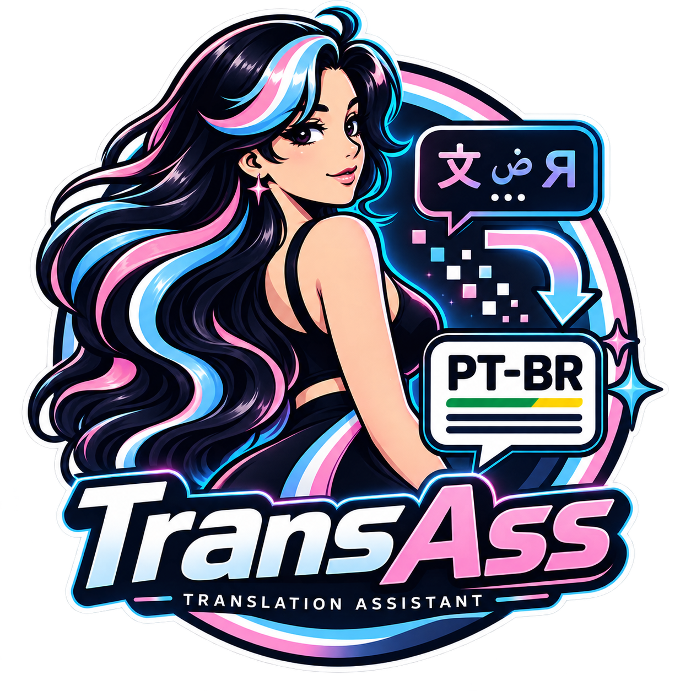

# Transass

<p align="center">
  
</p>

[](https://github.com/Eltonfk/TRANSASS/actions/workflows/ci.yml)
[](https://github.com/Eltonfk/TRANSASS/actions/workflows/desktop.yml)
[](LICENSE)

O **Transass** traduz legendas `.ass` e `.ssa` para português do Brasil,
preserva a estrutura visual e mantém evidência suficiente para explicar o que
aconteceu quando um modelo decide improvisar jazz.

O nome junta *translation* com o formato ASS. A coincidência anatômica foi
aceita pelo comitê de uma pessoa só.

> Versão do aplicativo: **2.5.2**. O identificador `v2_3_8` é o pipeline
> canônico; ele não é a versão exibida ao usuário.

## O que ele faz

- traduz episódios e temporadas com fila persistente e progresso em tempo real;
- usa Ollama local, Gemini, Groq, DeepSeek, NVIDIA NIM ou endpoint
  OpenAI-compatible;
- permite fallback opcional apenas para falhas de transporte;
- reconhece faixas cujo rótulo está errado pelo conteúdo real da legenda;
- traduz letras OP/ED em inglês sem confundir elenco, créditos e timecodes com
  karaokê;
- preserva tags, estilos, tempos, camadas e quebras ASS;
- publica `.pt-BR.ass`, mantém acervo com lineage e oferece revisão humana;
- monitora temperatura em Linux e Windows sem assumir que toda GPU é NVIDIA;
- roda como aplicativo nativo no Linux/Windows ou como serviço Docker.

## Instalação rápida

### Aplicativo Desktop

Baixe o artefato da [release mais recente](https://github.com/Eltonfk/TRANSASS/releases/latest):

- Linux x86_64: `Transass-x86_64.AppImage`;
- Windows x64: `Transass-Setup-2.5.2.exe`.

O Desktop abre a interface dentro da própria janela. Existe um servidor Flask
local nos bastidores, mas ele fica em `127.0.0.1`; o navegador não é convidado
para a festa.

### Docker

```sh
git clone https://github.com/Eltonfk/TRANSASS.git
cd TRANSASS
cp .env.example .env
# Edite MEDIA_ROOT e STATE_DIR antes de continuar.
docker build --pull=false -f deploy/Dockerfile -t transass:v2.5.2 .
docker compose --env-file .env -f deploy/compose.yaml up -d
```

A interface estará em `http://localhost:5050`.

## Desenvolvimento e testes

```sh
python3 -m venv .venv
source .venv/bin/activate
pip install -r requirements.lock -r requirements-test.lock
PYTHONPATH=.:src/subtranslate python3 -m pytest tests/offline -q
```

Os testes que chamam modelos ficam em `tests/model/` e nunca entram no gate
offline por acidente.

## Mapa do repositório

```text
src/subtranslate/   núcleo, web app, pipelines e providers
desktop/            janela Qt, empacotamento e testes Desktop
deploy/             Dockerfile, Compose e ffmpeg estático
resources/          glossários versionados
tests/offline/      suíte determinística sem modelo/rede
tests/model/        probes opt-in com modelo real
docs/               documentação operacional e técnica
```

## Documentação

Comece pelo [índice da documentação](docs/README.md). Os atalhos mais usados:

- [Instalação](docs/INSTALLATION.md)
- [Configuração](docs/CONFIGURATION.md)
- [Operações](docs/OPERATIONS.md)
- [Arquitetura](docs/ARCHITECTURE.md)
- [Pipelines](docs/PIPELINES.md)
- [Desktop](docs/DESKTOP.md)
- [Testes](docs/TESTING.md)
- [Segurança](SECURITY.md)

## Contribuição e licença

Leia [CONTRIBUTING.md](CONTRIBUTING.md) e o
[Código de Conduta](CODE_OF_CONDUCT.md). O projeto usa a licença [MIT](LICENSE).
